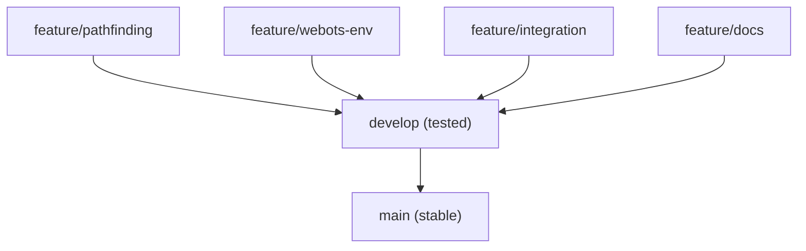

[](https://github.com/Karacsony-Mate/delivery_simulation/actions/workflows/python-tests.yml)

# 🚚 Delivery Simulator – Team Repository

This repository contains all sources for the **delivery simulation project**:
- Algorithms (path planning)
- Webots simulation
- Integration code
- Documentation

The repository is organized using GitHub branches and Pull Requests for clean collaboration.

---


## 🌳 Branch Structure

- **main**: Stable, releasable code and documentation. Only merged via Pull Requests.
- **develop**: Main development branch for completed and tested features.
- **feature/pathfinding**, **feature/webots-env**, **feature/integration**, **feature/docs**: Separate branches for each task or module. Work on your part here, then open a PR to develop.

---


## 🛠️ How to Work

### 1. Clone the Repository

```bash
git clone <repo-url>
cd delivery_simulation
```

### 2. Switch to Your Feature Branch

Feature branches are already created for each task or module. Always start from the **develop** branch, then switch to your assigned feature branch:
```bash
git checkout develop
git pull
git checkout feature/<your-feature-name>
```

### 3. Work and Commit

Write your code or documentation, then run:
```bash
git add .
git commit -m "Short, clear message"
git push -u origin feature/<your-feature-name>
```

### 4. Open a Pull Request (PR)

- Open a PR targeting the develop branch.
- Fill out the PR template (description, what changed).
- At least one review is required before merging.

### 5. Merge develop → main

When **develop** is stable and all tests pass, open a PR to main.
Only code ready for release goes here.

---


## 📄 Documentation

Official documentation is stored in **Word format** in the **docs/** folder.
Changes are tracked in the Git commit history (who updated and when).


## ✅ CI and Testing

The repository includes a GitHub Action (**python-tests.yml**) that runs Python tests.
A PR can only be merged if all tests pass.

---


## 🆘 If You Make a Mistake

```bash
git checkout develop
git pull
git checkout -b feature/<retry-name>
```

---


## 🔀 Branch Flow




## 📁 Folder Structure

```
delivery_simulation/
│
├── algorithms/           # Pathfinding algorithm implementations, unit tests
├── webots/               # Webots worlds, controllers, robot PROTOs
│   ├── worlds/
│   └── controllers/
├── integration/          # Bridge code between algorithms and Webots
├── docs/                 # Notes, .docx files, diagrams
│
├── .github/
│   ├── workflows/        # CI (Python tests)
│   ├── ISSUE_TEMPLATE/   # bug_report.md, feature_request.md
│   └── PULL_REQUEST_TEMPLATE.md
│
├── .gitignore
└── README.md
```
